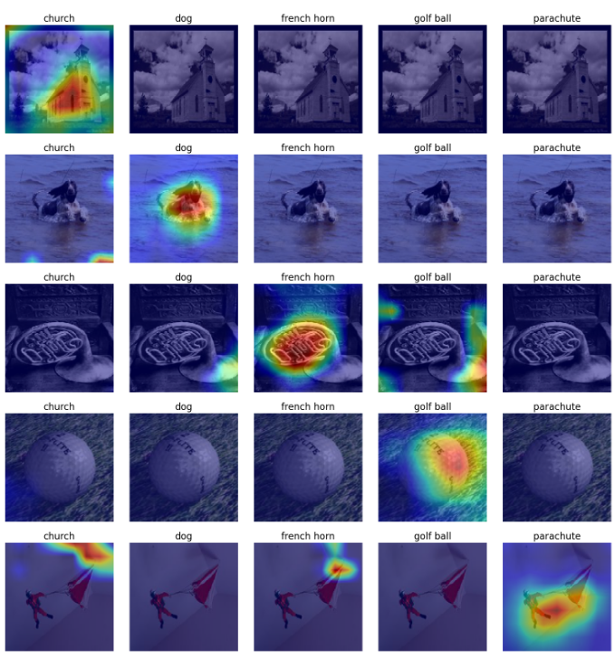

<h1>Grad-CAM on VGG16 Model</h1>
<h2>Overview</h2>
This project focuses on training a VGG16 model on the Imagenette dataset and applying the Grad-CAM (Gradient-weighted Class Activation Mapping) technique to interpret the model's predictions. The goal is to not only fine-tune the VGG16 architecture on a smaller dataset but also visualize and understand how the model makes decisions.
<h2>About Grad-CAM</h2> 
Grad-CAM, or Gradient-weighted Class Activation Mapping, is a visualization technique used to interpret the predictions of convolutional neural networks (CNNs). By leveraging the gradients of the target class with respect to the final convolutional layer, Grad-CAM generates a heatmap that highlights the regions of the input image most relevant to the model's prediction. This method is particularly valuable for understanding how a model focuses on specific features within an image, making it a powerful tool for model interpretability and debugging.
<h2>Objective</h2>
The key objectives of the project are:
<ol>
  <li>
    Train the VGG16 Model: Fine-tune the pre-trained VGG16 architecture using the Imagenette dataset.
  </li>
  <li>
    Evaluate Model Performance: Analyze how well the model performs on the Imagenette dataset
  </li>
  <li>
    Apply Grad-CAM: Implement and test the Grad-CAM method to generate visual explanations for the model’s predictions.
  </li>
</ol>
<h2>
  Model Evaluation
</h2>
<table align="center" border="1" cellpadding="10" cellspacing="0">
  <thead>
    <tr style="background-color: #f2f2f2;">
      <th style="text-align: center;">Dataset</th>
      <th style="text-align: center;">Accuracy</th>
    </tr>
  </thead>
  <tbody>
    <tr>
      <td style="text-align: center;">Training</td>
      <td style="text-align: center;">95.0%</td>
    </tr>
    <tr>
      <td style="text-align: center;">Validation</td>
      <td style="text-align: center;">92.2%</td>
    </tr>
    <tr>
      <td style="text-align: center;">Test</td>
      <td style="text-align: center;">91.1%</td>
    </tr>
  </tbody>
</table>
<h2>
  Grad-CAM Heatmaps
</h2>
Heatmaps highlight regions of the input image that strongly influence the model's decision for a specific output class.

  

